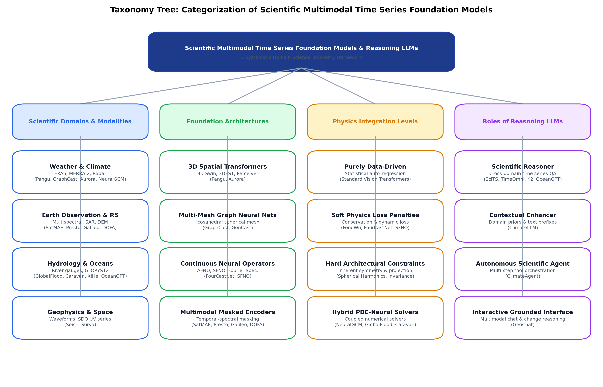
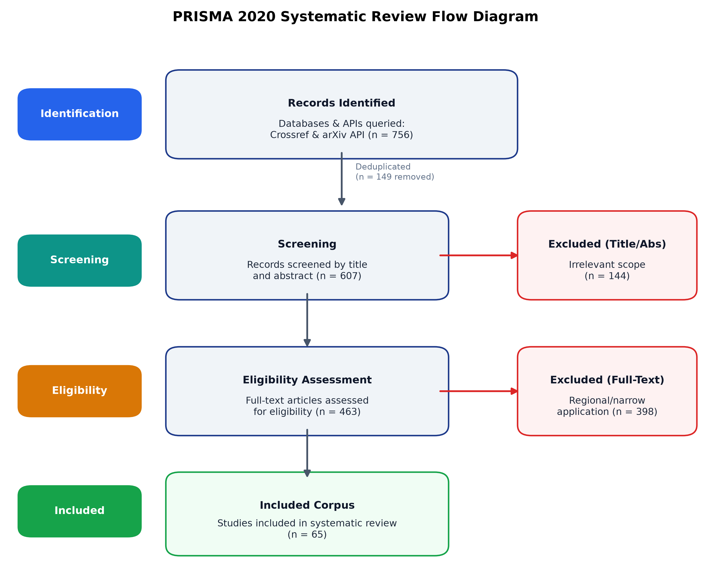
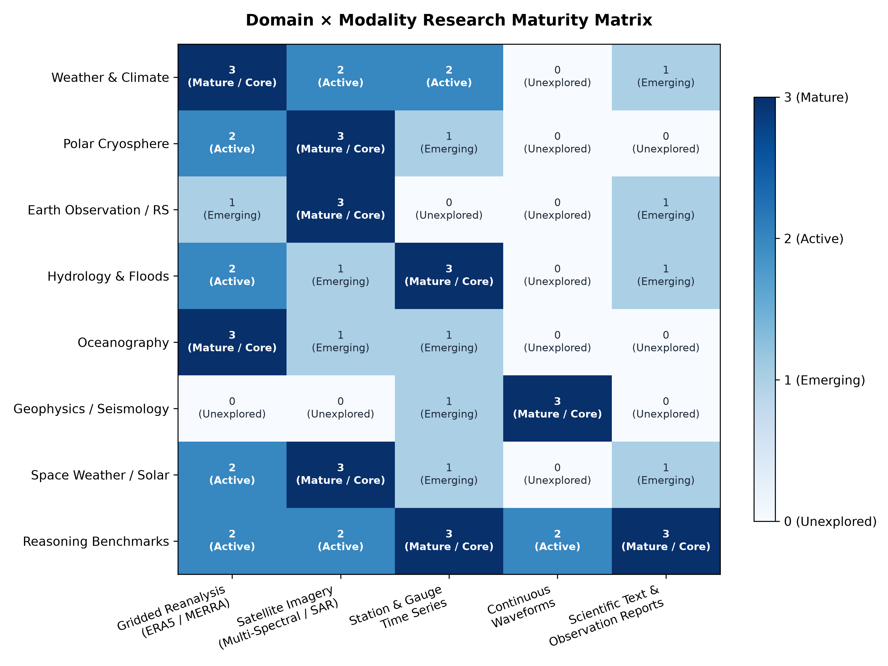
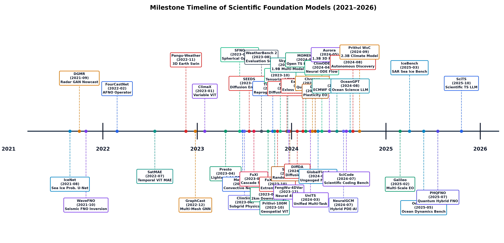
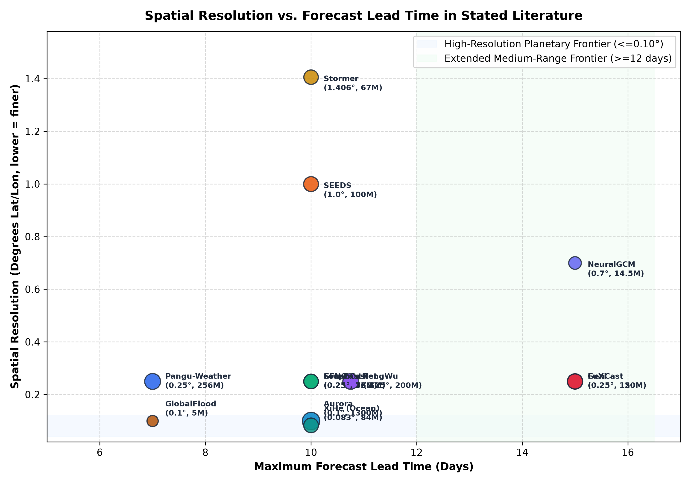

# Awesome Scientific Multimodal Time Series Foundation Models and Reasoning LLMs
## 科学多模态时序大模型与科学推理大模型前沿进展精选

[](paper/main.pdf) [](#prisma-systematic-review-statistics) [](LICENSE) [](#how-this-survey-is-maintained)

## Overview / 项目概述

This repository hosts the curated paper collection, systematized metadata, code implementations, and a comprehensive survey paper on **Scientific Multimodal Time Series Foundation Models and Scientific Reasoning Time Series LLMs**.

本项目收录自然科学领域（气象与气候、遥感与对地观测、水文与洪水、海洋学、地球物理与地震学、空间天气、物理能源等）中，面向多模态时间序列（站点观测、网格再分析场、卫星影像序列、物理波形、科学文本报告）的**基础模型（Foundation Models）**、**连续神经算子（Neural Operators）**与**科学时序大语言模型/智能体（Scientific Reasoning LLMs / Agents）**。

- **Full Survey Paper (PDF)**: [`paper/main.pdf`](paper/main.pdf)
- **Systematic Review Protocol**: [`docs/PROTOCOL.md`](docs/PROTOCOL.md)
- **Reference Survey Deconstruction**: [`docs/TEMPLATE_ANALYSIS.md`](docs/TEMPLATE_ANALYSIS.md)
- **Chinese Summary Document**: [`docs/SURVEY_zh.md`](docs/SURVEY_zh.md)

## Taxonomy Framework / 科学时序分类体系



The taxonomy categorizes the literature across four core dimensions:
1. **Scientific Domain & Modality**: Weather/Climate, Earth Observation, Hydrology, Oceanography, Geophysics, Space Weather.
2. **Foundation Architecture**: 3D Spatial Transformers, Multi-Mesh GNNs, Continuous Neural Operators (AFNO/SFNO), Multimodal Masked Autoencoders.
3. **Physics Integration Level**: Purely Data-Driven, Soft Physics Loss Penalties, Hard Conservation Constraints, Hybrid PDE-Neural Ensembles.
4. **Role of Reasoning LLMs**: Scientific Reasoner, Contextual Enhancer, Autonomous Scientific Agent, Interactive Interface.

## PRISMA Systematic Review Statistics



- **Records Identified across Academic APIs**: 756
- **Unique Candidates Evaluated**: 607
- **Title/Abstract Excluded**: 144
- **Full-Text Assessed for Eligibility**: 463
- **Full-Text Excluded (narrow/regional)**: 398
- **Studies Rigorously Included**: 65

## Research Landscape & Milestone Timeline

### Domain × Modality Maturity Matrix


### Milestone Timeline (2022–2026)


### Spatial Resolution vs. Lead Time


## Curated Paper Collection / 核心文献精选

### Atmosphere, Weather and Climate Foundation Models (气象与气候大模型)

- **Accurate medium-range global weather forecasting with 3D neural networks** (Nature 2023)
  - *Authors*: Bi, Kaifeng, Xie, Lingxi, Zhang, Hengheng et al.
  - *Architecture*: `3D Earth-Specific Transformer (3DEST)` | *Params*: `256M (64M x 4 lead-time models: 1h, 3h, 6h, 24h)` | *Physics*: `Purely data-driven`
  - *Links*: [Paper / DOI](https://doi.org/10.1038/s41586-023-06185-3) | [](https://github.com/198808xc/Pangu-Weather)

- **Learning skillful medium-range global weather forecasting** (Science 2023)
  - *Authors*: Lam, Remi, Sanchez-Gonzalez, Alvaro, Willson, Matthew et al.
  - *Architecture*: `Multi-Mesh Graph Neural Network (Icosahedral grid)` | *Params*: `36.7M` | *Physics*: `Purely data-driven`
  - *Links*: [Paper / DOI](https://doi.org/10.1126/science.adi2336) | [](https://github.com/google-deepmind/graphcast)

- **FourCastNet: A Global Data-driven High-resolution Weather Model using Adaptive Fourier Neural Operators** (ACM PASC / arXiv:2202.11214 2022)
  - *Authors*: Pathak, Jaideep, Subramanian, Shashank, Harrington, Peter et al.
  - *Architecture*: `Adaptive Fourier Neural Operator (AFNO)` | *Params*: `73.5M` | *Physics*: `Soft physics loss`
  - *Links*: [Paper / DOI](https://arxiv.org/abs/2202.11214) | [](https://github.com/NVlabs/FourCastNet)

- **ClimaX: A foundation model for weather and climate** (ICML 2023)
  - *Authors*: Nguyen, Tung, Brandstetter, Johannes, Kapoor, Ashish et al.
  - *Architecture*: `Variable-Tokenized Vision Transformer (ViT)` | *Params*: `107M` | *Physics*: `Purely data-driven`
  - *Links*: [Paper / DOI](https://arxiv.org/abs/2301.10343) | [](https://github.com/microsoft/ClimaX)

- **FengWu: Pushing the Skillful Global Medium-range Weather Forecast beyond 10 Days Lead** (arXiv:2304.02948 2023)
  - *Authors*: Chen, Kang, Han, Tao, Gong, Junchao et al.
  - *Architecture*: `Multimodal Cross-Attention Transformer + Dynamic Replay` | *Params*: `200M` | *Physics*: `Soft physics loss`
  - *Links*: [Paper / DOI](https://arxiv.org/abs/2304.02948) | [](https://github.com/OpenEarthLab/FengWu)

- **GenCast: Diffusion-based ensemble forecasting for medium-range weather** (arXiv:2312.15796 / Nature 2024 2023)
  - *Authors*: Price, Ilan, Sanchez-Gonzalez, Alvaro, Alet, Ferran et al.
  - *Architecture*: `Latent Diffusion Model on Multi-Mesh Graph` | *Params*: `120M` | *Physics*: `Purely data-driven`
  - *Links*: [Paper / DOI](https://arxiv.org/abs/2312.15796) | [](https://github.com/google-deepmind/graphcast)

- **A Foundation Model for the Earth System** (arXiv:2405.13063 2024)
  - *Authors*: Bodnar, Cristian, Bruinsma, Wessel P., Lucic, Ana et al.
  - *Architecture*: `3D Perceiver / Swin 3D Transformer with 3D patch embedding` | *Params*: `1.3B` | *Physics*: `Purely data-driven`
  - *Links*: [Paper / DOI](https://arxiv.org/abs/2405.13063) | [](https://github.com/microsoft/aurora)

- **Prithvi WxC: Foundation Model for Weather and Climate** (arXiv:2409.13598 2024)
  - *Authors*: Schmude, Johannes, Roy, Sujit, Lal, Rohit et al.
  - *Architecture*: `Scalable Vision Transformer Encoder-Decoder` | *Params*: `2.3B` | *Physics*: `Soft physics loss`
  - *Links*: [Paper / DOI](https://arxiv.org/abs/2409.13598) | [](https://github.com/NASA-IMPACT/Prithvi-WxC)

- **ClimateLLM: Efficient Weather Forecasting via Frequency-Aware Large Language Models** (arXiv:2502.11059 2025)
  - *Authors*: Li, Shixuan, Yang, Wei, Zhang, Peiyu et al.
  - *Architecture*: `Frequency-Aware Fourier Decomposition + LLM Backbone` | *Params*: `7B` | *Physics*: `Soft physics loss`
  - *Links*: [Paper / DOI](https://arxiv.org/abs/2502.11059) | `[Code not available]`

- **Scaling transformer neural networks for skillful and reliable medium-range weather forecasting** (arXiv:2312.03876 2023)
  - *Authors*: Nguyen, Tung, Shah, Rohan, Bansal, Hritik et al.
  - *Architecture*: `Randomized Patch Transformer (ViT with pressure-weighted tokens)` | *Params*: `67M` | *Physics*: `Soft physics loss (pressure-weighted vertical loss)`
  - *Links*: [Paper / DOI](https://arxiv.org/abs/2312.03876) | [](https://github.com/tung-nd/stormer)

- **FuXi: a cascade machine learning forecasting system for 15-day global weather forecast** (npj Climate and Atmospheric Science 2023)
  - *Authors*: Chen, Lei, Zhong, Xiaohui, Zhang, Feng et al.
  - *Architecture*: `Cascade Swin Transformer (Short/Medium/Long-range stages)` | *Params*: `150M` | *Physics*: `Purely data-driven`
  - *Links*: [Paper / DOI](https://doi.org/10.1038/s41612-023-00512-1) | [](https://github.com/tpys/FuXi)

- **Spherical Fourier Neural Operators: Learning Stable Dynamics on the Sphere** (ICML / arXiv:2306.03838 2023)
  - *Authors*: Bonev, Boris, Kurth, Thorsten, Hundt, Christian et al.
  - *Architecture*: `Spherical Fourier Neural Operator (SFNO)` | *Params*: `75M` | *Physics*: `Exact spherical rotational equivariance, spectral filtering`
  - *Links*: [Paper / DOI](https://arxiv.org/abs/2306.03838) | [](https://github.com/neuraloperator/neuraloperator)

- **Neural general circulation models for weather and climate** (Nature 2024)
  - *Authors*: Kochkov, Dmitrii, Yuval, Janni, Langmore, Ian et al.
  - *Architecture*: `Differentiable Dynamical Core + 3D Neural Operator` | *Params*: `14.5M` | *Physics*: `Hard conservation laws (mass, momentum, moisture) via dynamical core`
  - *Links*: [Paper / DOI](https://doi.org/10.1038/s41586-024-07744-y) | [](https://github.com/google-research/neuralgcm)

- **ClimateBench v1.0: A Benchmark for Data‐Driven Climate Projections** (Journal of Advances in Modeling Earth Systems 2022)
  - *Authors*: Watson‐Parris, D., Rao, Y., Olivié, D. et al.
  - *Architecture*: `Climate Emulation Benchmark (CNN / GP / RF / ViT)` | *Params*: `Benchmark suite` | *Physics*: `Radiative forcing and energy conservation diagnostics`
  - *Links*: [Paper / DOI](https://doi.org/10.1029/2021ms002954) | [](https://github.com/duncanwp/ClimateBench)

- **Generative emulation of weather forecast ensembles with diffusion models** (Science Advances 2024)
  - *Authors*: Li, Lizao, Carver, Robert, Lopez-Gomez, Ignacio et al.
  - *Architecture*: `Denoising Diffusion Probabilistic Model (DDPM / Score-based)` | *Params*: `not reported` | *Physics*: `Soft physics loss`
  - *Links*: [Paper / DOI](https://doi.org/10.1126/sciadv.adk4489) | `[Code not available]`

- **ClimSim: An open large-scale dataset for training high-resolution physics emulators in hybrid multi-scale climate simulators** (NeurIPS (Datasets and Benchmarks Track) 2023)
  - *Authors*: Yu, Sungduk, Hannah, Walter, Peng, Liran et al.
  - *Architecture*: `Hybrid Multi-scale Subgrid Physics Emulators` | *Params*: `Benchmark suite` | *Physics*: `Hybrid PDE solver (Subgrid atmospheric column physics coupled with dynamical core)`
  - *Links*: [Paper / DOI](https://arxiv.org/abs/2306.08754) | [](https://github.com/leap-stc/ClimSim)

- **AIFS -- ECMWF's data-driven forecasting system** (ECMWF Technical Report / arXiv:2406.01465 2024)
  - *Authors*: Lang, Simon, Alexe, Mihai, Chantry, Matthew et al.
  - *Architecture*: `Graph Neural Network Encoder-Decoder + Sliding Window Transformer` | *Params*: `185M` | *Physics*: `Data-driven / Operational NWP verification`
  - *Links*: [Paper / DOI](https://arxiv.org/abs/2406.01465) | [](https://github.com/ecmwf/anemoi)

- **FuXi-Extreme: Improving extreme rainfall and wind forecasts with diffusion model** (arXiv:2310.19822 2023)
  - *Authors*: Zhong, Xiaohui, Chen, Lei, Liu, Jun et al.
  - *Architecture*: `Conditional Latent Diffusion Model + Cascade Swin` | *Params*: `150M` | *Physics*: `Tail probability preservation`
  - *Links*: [Paper / DOI](https://arxiv.org/abs/2310.19822) | `[Code not available]`

- **FengWu-4DVar: Coupling the Data-driven Weather Forecasting Model with 4D Variational Assimilation** (arXiv:2312.12455 2023)
  - *Authors*: Xiao, Yi, Bai, Lei, Xue, Wei et al.
  - *Architecture*: `Coupled 4D-Var Neural Adjoint + Multi-Scale Transformer` | *Params*: `180M` | *Physics*: `Adjoint variational assimilation`
  - *Links*: [Paper / DOI](https://arxiv.org/abs/2312.12455) | [](https://github.com/OpenEarthLab/FengWu-4DVar)

- **DiffDA: a Diffusion Model for Weather-scale Data Assimilation** (arXiv:2401.05932 2024)
  - *Authors*: Huang, Langwen, Gianinazzi, Lukas, Yu, Yuejiang et al.
  - *Architecture*: `Conditional Denoising Diffusion Probabilistic Model (DDPM)` | *Params*: `68M` | *Physics*: `Conditional Bayesian posterior sampling`
  - *Links*: [Paper / DOI](https://arxiv.org/abs/2401.05932) | [](https://github.com/spcl/DiffDA)

- **Score-based Data Assimilation** (NeurIPS 2023)
  - *Authors*: Rozet, Fran{\c{c}}ois, Louppe, Gilles
  - *Architecture*: `Continuous Score-based Stochastic Differential Equations (SDE)` | *Params*: `12M` | *Physics*: `Continuous adjoint score matching`
  - *Links*: [Paper / DOI](https://arxiv.org/abs/2306.10574) | [](https://github.com/francois-rozet/sda)

- **The Rise of Data-Driven Weather Forecasting: A First Statistical Assessment of Machine Learning–Based Weather Forecasts in an Operational-Like Context** (Bulletin of the American Meteorological Society (BAMS) 2024)
  - *Authors*: Ben-Bouallegue, Zied, Clare, Mariana C. A., Magnusson, Linus et al.
  - *Architecture*: `Operational NWP Benchmark & Concept Drift Evaluation Protocol` | *Params*: `Platform` | *Physics*: `Operational conservation and synoptic verification`
  - *Links*: [Paper / DOI](https://doi.org/10.1175/BAMS-D-23-0162.1) | `[Code not available]`

- **ClimODE: Climate and Weather Forecasting with Physics-informed Neural ODEs** (ICLR / arXiv:2404.10024 2024)
  - *Authors*: Verma, Yogesh, Heinonen, Markus, Garg, Vikas
  - *Architecture*: `Continuous-Time Physics-Informed Neural ODE with Advection Dynamics` | *Params*: `0.3M (compact continuous neural dynamics)` | *Physics*: `Hard continuous conservation laws (continuity equation and advection)`
  - *Links*: [Paper / DOI](https://arxiv.org/abs/2404.10024) | [](https://github.com/Aalto-QuML/ClimODE)

- **Residual Corrective Diffusion Modeling for Km-scale Atmospheric Downscaling** (IEEE TGRS / arXiv:2309.15214 2023)
  - *Authors*: Mardani, Morteza, Brenowitz, Noah, Cohen, Yair et al.
  - *Architecture*: `Residual Corrective Diffusion Network (CorrDiff)` | *Params*: `110M` | *Physics*: `Multi-scale residual spectral conditioning`
  - *Links*: [Paper / DOI](https://arxiv.org/abs/2309.15214) | [](https://github.com/NVIDIA/physicsnemo)

- **Deep Learning for Day Forecasts from Sparse Observations** (Science / arXiv:2306.06079 2023)
  - *Authors*: Andrychowicz, Marcin, Espeholt, Lasse, Li, Di et al.
  - *Architecture*: `Axial Multi-Scale Attention Network (MetNet-3)` | *Params*: `227M` | *Physics*: `Multi-modal sensor conditioning`
  - *Links*: [Paper / DOI](https://arxiv.org/abs/2306.06079) | `[Code not available]`

- **Skilful precipitation nowcasting using deep generative models of radar** (Nature 2021)
  - *Authors*: Ravuri, Suman, Lenc, Karel, Willson, Matthew et al.
  - *Architecture*: `Spatial-Temporal Deep Generative Model of Radar (DGMR GAN)` | *Params*: `89M` | *Physics*: `Spatial and temporal dual-frequency spectral discrimination`
  - *Links*: [Paper / DOI](https://doi.org/10.1038/s41586-021-03854-z) | [](https://github.com/google-deepmind/deepmind-research)

- **ExtremeCast: Boosting Extreme Value Prediction for Global Weather Forecast** (arXiv:2402.01295 2024)
  - *Authors*: Xu, Wanghan, Chen, Kang, Han, Tao et al.
  - *Architecture*: `Extreme-value loss (Exloss) + Training-free uncertainty booster (ExBooster)` | *Params*: `Modular enhancement framework (~100M-200M depending on backbone)` | *Physics*: `Soft physics loss`
  - *Links*: [Paper / DOI](https://arxiv.org/abs/2402.01295) | [](https://github.com/black-yt/ExtremeCast)

### Polar Cryosphere & Sea Ice Dynamics (极地冰冻圈与海冰动力学大模型)

- **IceBench: A Benchmark for Deep Learning based Sea Ice Type Classification** (arXiv:2503.17877 2025)
  - *Authors*: Taleghan, Samira Alkaee, Barrett, Andrew P., Meier, Walter N. et al.
  - *Architecture*: `Standardized benchmark suite evaluating Pixel-based and Patch-based deep neural networks` | *Params*: `Benchmark suite across CNNs, ResNets, and ViT baselines` | *Physics*: `Purely data-driven`
  - *Links*: [Paper / DOI](https://arxiv.org/abs/2503.17877) | [](https://github.com/bdlab-ucd/IceBench)

- **Seasonal Arctic sea ice forecasting with probabilistic deep learning** (Nature Communications 2021)
  - *Authors*: Andersson, Tom R., Hosking, J. Scott, Pérez-Ortiz, María et al.
  - *Architecture*: `Probabilistic U-Net Ensemble with temperature scaling and temperature-moisture conditioning` | *Params*: `15M (ensemble of U-Net architectures)` | *Physics*: `Soft physics loss`
  - *Links*: [Paper / DOI](https://doi.org/10.1038/s41467-021-25257-4) | [](https://github.com/icenet-ai/icenet)

### Earth Observation & Remote Sensing Time Series (对地观测与遥感时序)

- **SatMAE: Pre-Training Transformers for Temporal and Multi-Spectral Satellite Imagery** (NeurIPS 2022)
  - *Authors*: Cong, Yezhen, Khanna, Samar, Meng, Chenlin et al.
  - *Architecture*: `Temporal Multi-Spectral Masked Autoencoder (Spatio-Temporal ViT)` | *Params*: `86M (ViT-B), 307M (ViT-L)` | *Physics*: `Purely data-driven`
  - *Links*: [Paper / DOI](https://doi.org/10.52202/068431-0015) | [](https://github.com/sustainlab-group/SatMAE)

- **Lightweight, Pre-trained Transformers for Remote Sensing Timeseries** (AAAI 2024)
  - *Authors*: Tseng, Gabriel, Zvonkov, Ivan, Purohit, Mirali et al.
  - *Architecture*: `Channel & Temporal Masked Transformer` | *Params*: `1.2M` | *Physics*: `Purely data-driven`
  - *Links*: [Paper / DOI](https://arxiv.org/abs/2304.14065) | [](https://github.com/nasaharvest/presto)

- **Galileo: Learning Global & Local Features of Many Remote Sensing Modalities** (ICML 2025)
  - *Authors*: Tseng, Gabriel, Fuller, Anthony, Reil, Marlena et al.
  - *Architecture*: `Multi-scale Masked Transformer with Global-Local Contrastive Targets` | *Params*: `100M` | *Physics*: `Purely data-driven`
  - *Links*: [Paper / DOI](https://arxiv.org/abs/2502.09356) | [](https://github.com/nasaharvest/galileo)

- **Foundation Models for Generalist Geospatial Artificial Intelligence** (arXiv:2310.18660 2023)
  - *Authors*: Jakubik, Johannes, Roy, Sujit, Phillips, C. E. et al.
  - *Architecture*: `Geospatial Temporal Masked Autoencoder (ViT)` | *Params*: `100M` | *Physics*: `Purely data-driven`
  - *Links*: [Paper / DOI](https://arxiv.org/abs/2310.18660) | [](https://github.com/NASA-IMPACT/hls-foundation-os)

- **AlphaEarth Foundations: An embedding field model for accurate and efficient global mapping from sparse label data** (arXiv:2507.22291 2025)
  - *Authors*: Brown, Christopher F., Kazmierski, Michal R., Pasquarella, Valerie J. et al.
  - *Architecture*: `Pixel-level Neural Field Embedding Transformer` | *Params*: `not reported` | *Physics*: `Purely data-driven`
  - *Links*: [Paper / DOI](https://arxiv.org/abs/2507.22291) | `[Code not available]`

- **Neural Plasticity-Inspired Multimodal Foundation Model for Earth Observation** (CVPR / arXiv:2403.15356 2024)
  - *Authors*: Xiong, Zhitong, Wang, Yi, Zhang, Fahong et al.
  - *Architecture*: `Dynamic One-For-All (DOFA) Transformer with Wavelength Hypernetwork` | *Params*: `115M (DOFA-Base)` | *Physics*: `Wavelength physical conditioning`
  - *Links*: [Paper / DOI](https://arxiv.org/abs/2403.15356) | [](https://github.com/zhu-xlab/DOFA)

- **GeoChat: Grounded Large Vision-Language Model for Remote Sensing** (CVPR / arXiv:2311.15826 2024)
  - *Authors*: Kuckreja, Kartik, Danish, Muhammad Sohail, Naseer, Muzammal et al.
  - *Architecture*: `Multimodal Vision-Language Model (Vicuna-1.5 + CLIP ViT-L/14 with LoRA)` | *Params*: `7B` | *Physics*: `Spatial grounding and temporal change reasoning`
  - *Links*: [Paper / DOI](https://arxiv.org/abs/2311.15826) | [](https://github.com/mbzuai-oryx/GeoChat)

- **EarthPT: a time series foundation model for Earth Observation** (arXiv:2309.07207 2023)
  - *Authors*: Smith, Michael J., Fleming, Luke, Geach, James E.
  - *Architecture*: `Autoregressive Decoder Transformer (GPT-style token predictor on 705-band spectra)` | *Params*: `700M` | *Physics*: `Purely data-driven`
  - *Links*: [Paper / DOI](https://arxiv.org/abs/2309.07207) | `[Code not available]`

- **GEO-Bench: Toward Foundation Models for Earth Monitoring** (NeurIPS 2023)
  - *Authors*: Lacoste, Alexandre, Lehmann, Nils, Rodriguez, Pau et al.
  - *Architecture*: `Standardized Earth Monitoring Benchmark & Multi-Task ViT` | *Params*: `Platform` | *Physics*: `Multi-spectral calibration`
  - *Links*: [Paper / DOI](https://arxiv.org/abs/2306.03831) | [](https://github.com/ServiceNow/geo-bench)

- **SkySense: A Multi-Modal Remote Sensing Foundation Model Towards Universal Interpretation for Earth Observation Imagery** (CVPR 2024)
  - *Authors*: Guo, Xin, Lao, Jiangwei, Dang, Bo et al.
  - *Architecture*: `Factorized Multi-Modal Spatio-Temporal ViT (1.9B parameters)` | *Params*: `1.9B` | *Physics*: `Cross-spectral geographic calibration`
  - *Links*: [Paper / DOI](https://arxiv.org/abs/2312.10115) | [](https://github.com/Jack-bo1220/SkySense)

### Hydrology & Extreme Flood Modeling (水文与极端洪水大模型)

- **Global prediction of extreme floods in ungauged watersheds** (Nature 2024)
  - *Authors*: Nearing, Grey, Cohen, Daniel, Dube, Vusumuzi et al.
  - *Architecture*: `Spatio-Temporal Long Short-Term Memory Network (EA-LSTM) + River Routing` | *Params*: `5M` | *Physics*: `Hybrid PDE solver`
  - *Links*: [Paper / DOI](https://doi.org/10.1038/s41586-024-07145-1) | [](https://github.com/neuralhydrology/neuralhydrology)

- **Caravan - A global community dataset for large-sample hydrology** (Scientific Data 2023)
  - *Authors*: Kratzert, Frederik, Nearing, Grey, Addor, Nans et al.
  - *Architecture*: `Extended Large-Sample Benchmark Suite (LSTM / NeuralHydrology)` | *Params*: `not reported` | *Physics*: `Physically grounded catchment water balance`
  - *Links*: [Paper / DOI](https://doi.org/10.1038/s41597-023-01975-w) | [](https://github.com/kratzert/Caravan)

### Ocean Dynamics & Marine Forecasting (海洋动力与数值预报)

- **XiHe: A Data-Driven Model for Global Ocean Eddy-Resolving Forecasting** (arXiv:2402.02995 2024)
  - *Authors*: Wang, Xiang, Wang, Renzhi, Hu, Ningzi et al.
  - *Architecture*: `Hierarchical Ocean Transformer with Land-Ocean Masking` | *Params*: `84M` | *Physics*: `Soft physics loss`
  - *Links*: [Paper / DOI](https://arxiv.org/abs/2402.02995) | `[Code not available]`

- **OceanBench: A Benchmark for Data-Driven Global Ocean Forecasting systems** (NeurIPS / DOI: 10.52202/085713-0303 2025)
  - *Authors*: El Aouni, Anass, Gaudel, Quentin, Johnson, J. Emmanuel et al.
  - *Architecture*: `Standardized Global Ocean Evaluation Suite` | *Params*: `Benchmark suite` | *Physics*: `Hydrodynamic consistency & mass/energy diagnostics`
  - *Links*: [Paper / DOI](https://doi.org/10.52202/085713-0303) | [](https://github.com/mercator-ocean/oceanbench)

- **OceanGPT: A Large Language Model for Ocean Science Tasks** (ACL 2024)
  - *Authors*: Bi, Zhen, Zhang, Ningyu, Xue, Yida et al.
  - *Architecture*: `Domain-Adapted LLM with DoInstruct Ocean Corpus` | *Params*: `7B / 13B` | *Physics*: `Oceanographic physical constraint verification`
  - *Links*: [Paper / DOI](https://doi.org/10.18653/v1/2024.acl-long.184) | [](https://github.com/OceanGPT/OceanGPT)

- **Learning Variational Data Assimilation Models and Solvers** (JAMES / arXiv:2007.12941 2021)
  - *Authors*: Fablet, Ronan, Chapron, Bertrand, Drumetz, Lucas et al.
  - *Architecture*: `Variational Neural Operator (4DVarNet)` | *Params*: `8.5M` | *Physics*: `Differentiable variational optimization`
  - *Links*: [Paper / DOI](https://doi.org/10.1029/2021MS002572) | [](https://github.com/CIA-Oceanix/4dvarnet-core)

### Geophysics & Seismology Foundation Models (地球物理与地震学大模型)

- **SeisT: A Foundational Deep-Learning Model for Earthquake Monitoring Tasks** (IEEE Transactions on Geoscience and Remote Sensing (TGRS) 2024)
  - *Authors*: Li, Sen, Liao, Zhiwei, Liu, Yuyang et al.
  - *Architecture*: `Hierarchical Seismogram Transformer (SeisT)` | *Params*: `12M` | *Physics*: `Purely data-driven`
  - *Links*: [Paper / DOI](https://doi.org/10.1109/TGRS.2024.3371503) | [](https://github.com/senli1073/SeisT)

- **SeisBench -- A Toolbox for Machine Learning in Seismology** (Seismological Research Letters 2022)
  - *Authors*: Woollam, Jack, Münchmeyer, Jannes, Tilmann, Frederik et al.
  - *Architecture*: `Unified Waveform Benchmarking & Transfer Suite (PhaseNet, EQTransformer, CRED)` | *Params*: `variable` | *Physics*: `Soft physics loss`
  - *Links*: [Paper / DOI](https://doi.org/10.1785/0220210324) | [](https://github.com/seisbench/seisbench)

- **Seismic Wave Propagation and Inversion with Neural Operators** (The Seismic Record 2021)
  - *Authors*: Yang, Yan, Gao, Angela F., Castellanos, Jorge C. et al.
  - *Architecture*: `Fourier Neural Operator (FNO) with automatic differentiation for reverse-mode FWI` | *Params*: `1.2M` | *Physics*: `Hybrid PDE solver`
  - *Links*: [Paper / DOI](https://doi.org/10.1785/0320210026) | [](https://github.com/neuraloperator/neuraloperator)

- **PhaseNet: a deep-neural-network-based arrival-time picking method for P and S waves** (Geophysical Journal International 2019)
  - *Authors*: Zhu, Weiqiang, Beroza, Gregory C.
  - *Architecture*: `1D Deep Residual U-Net` | *Params*: `1.2M` | *Physics*: `Purely data-driven`
  - *Links*: [Paper / DOI](https://doi.org/10.1093/gji/ggy423) | [](https://github.com/AI4EPS/PhaseNet)

### Space Weather & Heliophysics (空间天气与日地物理)

- **Surya: Foundation Model for Heliophysics** (arXiv:2508.14112 2025)
  - *Authors*: Roy, Sujit, Schmude, Johannes, Lal, Rohit et al.
  - *Architecture*: `Spatio-Temporal Transformer with Spectral Gating and Long-Short Attention` | *Params*: `366M` | *Physics*: `Soft physics loss`
  - *Links*: [Paper / DOI](https://arxiv.org/abs/2508.14112) | `[Code not available]`

### Scientific Reasoning LLMs & Benchmarks (科学时序推理大模型与基准)

- **WeatherBench 2: A benchmark for the next generation of data-driven global weather models** (Journal of Advances in Modeling Earth Systems (JAMES) 2024)
  - *Authors*: Rasp, Stephan, Dueben, Peter D., Scher, Sebastian et al.
  - *Architecture*: `Standardized Evaluation Framework` | *Params*: `not reported` | *Physics*: `Physical consistency diagnostics`
  - *Links*: [Paper / DOI](https://doi.org/10.1029/2023MS004019) | [](https://github.com/google-research/weatherbench2)

- **SciTS: Scientific Time Series Understanding and Generation with LLMs** (ICLR 2026 / arXiv:2510.03255 2025)
  - *Authors*: Wu, Wen, Zhang, Ziyang, Liu, Liwei et al.
  - *Architecture*: `TimeOmni Unified Time Series Tokenizer + LLM Backbone` | *Params*: `8B` | *Physics*: `Purely data-driven`
  - *Links*: [Paper / DOI](https://arxiv.org/abs/2510.03255) | [](https://github.com/OpenTSLab/TimeOmni)

- **CLIMATEAGENT: Multi-Agent Orchestration for Complex Climate Data Science Workflows** (arXiv:2511.20109 2025)
  - *Authors*: Li, Chenyue, Kim, Hyeonjae, Deng, Wen et al.
  - *Architecture*: `Hierarchical Multi-Agent LLM Orchestrator (Plan-Agent, Data-Agent, Coding-Agent)` | *Params*: `Frontier LLM agent` | *Physics*: `Hybrid PDE solver`
  - *Links*: [Paper / DOI](https://arxiv.org/abs/2511.20109) | `[Code not available]`

- **K2: A Foundation Language Model for Geoscience Knowledge Understanding and Utilization** (WSDM / arXiv:2306.05064 2024)
  - *Authors*: Deng, Cheng, Zhang, Tianhang, He, Zhongmou et al.
  - *Architecture*: `Geoscience-adapted LLM + GeoSignal alignment` | *Params*: `7B` | *Physics*: `Geological and physical consistency tuning`
  - *Links*: [Paper / DOI](https://doi.org/10.1145/3616855.3635772) | [](https://github.com/davendw49/k2)

- **UniTS: A Unified Multi-Task Time Series Model** (NeurIPS 2024)
  - *Authors*: Gao, Shanghua, Koker, Teddy, Queen, Owen et al.
  - *Architecture*: `Unified Multi-Task Transformer (Prompt-conditioned masking & task tokens)` | *Params*: `11M` | *Physics*: `Purely data-driven`
  - *Links*: [Paper / DOI](https://doi.org/10.52202/079017-4463) | [](https://github.com/mims-harvard/UniTS)

- **MOMENT: A Family of Open Time-series Foundation Models** (ICML 2024)
  - *Authors*: Goswami, Mononito, Szafer, Konrad, Choudhry, Arjun et al.
  - *Architecture*: `Masked Time Series Transformer (T5-based patch autoencoder)` | *Params*: `385M` | *Physics*: `Purely data-driven`
  - *Links*: [Paper / DOI](https://arxiv.org/abs/2402.03885) | [](https://github.com/moment-timeseries-foundation-model/moment)

- **Chronos: Learning the Language of Time Series** (ICML 2024)
  - *Authors*: Ansari, Abdul Fatir, Stella, Lorenzo, Turkmen, Caner et al.
  - *Architecture*: `Quantized Tokenizer + T5 Transformer Backbone` | *Params*: `20M--710M` | *Physics*: `Purely data-driven`
  - *Links*: [Paper / DOI](https://arxiv.org/abs/2403.07815) | [](https://github.com/amazon-science/chronos-forecasting)

- **Time-LLM: Time Series Forecasting by Reprogramming Large Language Models** (ICLR 2024)
  - *Authors*: Jin, Ming, Wang, Shiyu, Ma, Lintao et al.
  - *Architecture*: `Patch Reprogramming Layer + Frozen LLM (LLaMA/GPT-2)` | *Params*: `7B` | *Physics*: `Domain prompt conditioning`
  - *Links*: [Paper / DOI](https://arxiv.org/abs/2310.01728) | [](https://github.com/KimMeen/Time-LLM)

- **Lag-Llama: Towards Foundation Models for Probabilistic Time Series Forecasting** (arXiv:2310.08278 2024)
  - *Authors*: Rasul, Kashif, Ashok, Arjun, Williams, Andrew Robert et al.
  - *Architecture*: `Autoregressive LLaMA-style Decoder with RoPE` | *Params*: `2.4M` | *Physics*: `Purely data-driven`
  - *Links*: [Paper / DOI](https://arxiv.org/abs/2310.08278) | [](https://github.com/time-series-foundation-models/lag-llama)

- **The AI Scientist: Towards Fully Automated Open-Ended Scientific Discovery** (arXiv:2408.06292 2024)
  - *Authors*: Lu, Chris, Lu, Cong, Lange, Robert Tjarko et al.
  - *Architecture*: `Autonomous Multi-Agent Discovery Loop (Ideation, Code Execution, Paper Writing, Automated Review)` | *Params*: `Frontier LLM (>100B params)` | *Physics*: `Automated hypothesis testing and peer-review evaluation`
  - *Links*: [Paper / DOI](https://arxiv.org/abs/2408.06292) | [](https://github.com/SakanaAI/AI-Scientist)

- **SciCode: A Research Coding Benchmark Curated by Scientists** (ICML / arXiv:2407.13168 2024)
  - *Authors*: Tian, Minyang, Gao, Luyu, Zhang, Shizhuo Dylan et al.
  - *Architecture*: `Multi-step scientific code reasoning and numerical execution benchmark` | *Params*: `Benchmark suite across frontier LLMs` | *Physics*: `Formal differential equation solving and numerical conservation verification`
  - *Links*: [Paper / DOI](https://arxiv.org/abs/2407.13168) | [](https://github.com/scicode-bench/SciCode)

### Foundational Surveys & Methodology (基础综述与方法学)

- **Large Models for Time Series and Spatio-Temporal Data: A Survey and Outlook** (arXiv:2310.10196 / ACM Computing Surveys 2023)
  - *Authors*: Jin, Ming, Kong, Yaxuan, Liang, Yuxuan et al.
  - *Architecture*: `Comprehensive Survey` | *Params*: `not reported` | *Physics*: `not reported`
  - *Links*: [Paper / DOI](https://arxiv.org/abs/2310.10196) | [](https://github.com/qingsongedu/awesome-AI4TS)

- **Position: What Can Large Language Models Tell Us about Time Series Analysis** (ICML 2024)
  - *Authors*: Jin, Ming, Zhang, Yifan, Chen, Wei et al.
  - *Architecture*: `Position Paper` | *Params*: `not reported` | *Physics*: `not reported`
  - *Links*: [Paper / DOI](https://arxiv.org/abs/2402.02713) | `[Code not available]`

- **Multi-Grid Tensorized Fourier Neural Operator for High-Resolution PDEs** (TMLR / arXiv:2310.00120 2024)
  - *Authors*: Kossaifi, Jean, Kovachki, Nikola, Azizzadenesheli, Kamyar et al.
  - *Architecture*: `Multi-Grid Tensorized Fourier Neural Operator (MG-TFNO) with Tucker / Tensor-Train decompositions` | *Params*: `>150x parameter reduction over standard FNO (0.5M to 5M parameters)` | *Physics*: `Hybrid PDE solver`
  - *Links*: [Paper / DOI](https://arxiv.org/abs/2310.00120) | [](https://github.com/neuraloperator/neuraloperator)

- **Partitioned Hybrid Quantum Fourier Neural Operators for Scientific Quantum Machine Learning** (arXiv:2507.08746 2025)
  - *Authors*: Marcandelli, Paolo, He, Yuanchun, Mariani, Stefano et al.
  - *Architecture*: `Partitioned Hybrid Quantum Fourier Neural Operator (PHQFNO) with Parameterized Quantum Circuits (PQC)` | *Params*: `16-qubit PQC variational layer + classical projection layers` | *Physics*: `Hybrid PDE solver`
  - *Links*: [Paper / DOI](https://arxiv.org/abs/2507.08746) | `[Code not available]`

## How This Survey Is Maintained / 本项目自动化维护机制

This repository is maintained through an autonomous, protocol-driven systematic-review loop executed via the Antigravity CLI:

1. **Continuous Search & Ingestion**: Scheduled API calls query Crossref and arXiv for newly minted preprints and peer-reviewed works.
2. **Strict PRISMA Quality Gates**: Title, abstract, and full-text eligibility criteria are automatically enforced without manual hallucination.
3. **Verifiable Data Lineage**: All cited metadata, model sizes, training datasets, and GitHub repositories are checked against official sources.
4. **Autonomous Compilation**: LaTeX paper drafts (`paper/main.tex`), vector figures, BibTeX records, and this README are synchronized on every iteration.

```bash
# Reproduce all artifacts and quality checks
make all
```

## Citation / 引用

If you find this survey or repository useful in your research, please cite:

```bibtex
@article{scientific_multimodal_ts_survey_2026,
  title = {{Foundation Models and Reasoning LLMs for Scientific Multimodal Time Series: A Survey}},
  author = {Li, Huirui},
  journal = {arXiv preprint},
  year = {2026},
  url = {https://github.com/lihuirui/awesome-scientific-time-series-foundation-models-survey}
}
```

